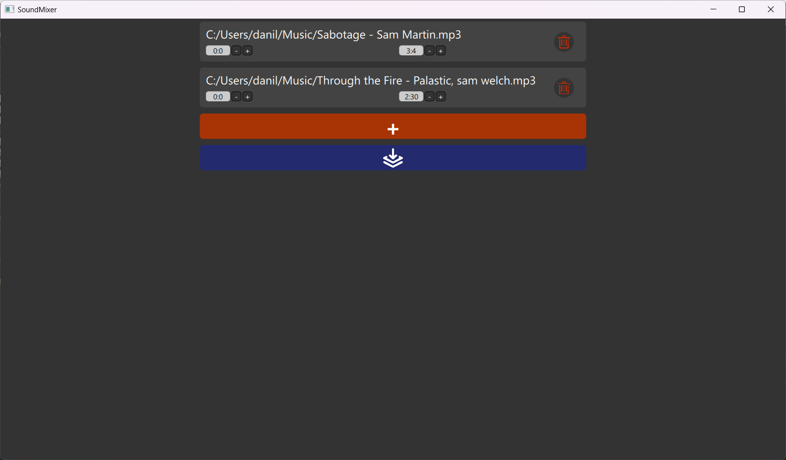

# Sound Mixer

`SoundMixer` is a program that combines two or more audio tracks.

# Dependencies

Dependencies:
- CMake
- Boost
- Libsndfile
- Qt

# Licence
[The MIT License](https://github.com/Dandenet/SoundMixer/blob/master/LICENSE)